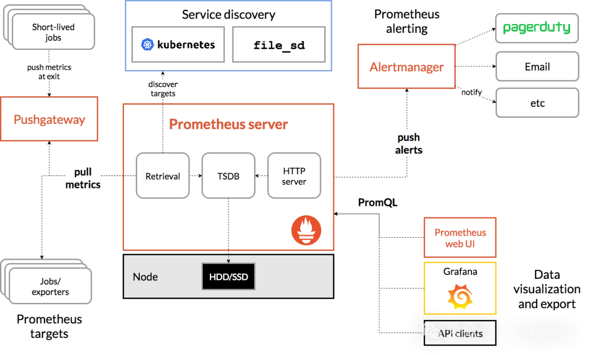

## prometheus介绍
> Prometheus 是一个开源的系统监控和报警工具，专为高效采集和存储时间序列数据而设计，目前广泛用于监控微服务架构、云基础设施和Kubernetes集群等环境.
---

Prometheus的架构图如下:

---

exporter可以理解为prometheus的客户端，作用是把从节点 ( 操作系统或应用服务或存储等) 中采集到的监控数据作为Metrics指标，再将Metrics指标以HTTP的方式暴露给Prometheus。常用的exporter有node exporter、mysql exporter等

### 1. metrics介绍
在Prometheus中，"metrics"（度量）是指系统或应用程序的性能数据或状态数据，这些数据以时间序列的形式存储，并用于监控和分析。Prometheus 的 metrics 数据模型是基于时间序列（time series）的，每个时间序列由以下几个部分组成：
- [x] 指标名称 (Metric Name): 描述指标的名称
- [x] 标签 (Labels): 可选，一组键值对，用于标识同一指标的不同实例
- [x] 时间戳 (Timestamp): 可选的 Unix 时间戳，表示指标记录的时间点
- [x] 值 (Value): 指标的数值

Metrics的数据模型如下图所示：

---

### 2. metrics的类型
为了能够帮助用户理解和区分这些不同监控指标之间的差异，Prometheus 定义了 4 种不同的指标类型（Metric Type），分别是：Counter（计数器）、Gauge（仪表盘）、Histogram（直方图）、Summary（摘要）。

#### 2.1 Counter
- [x] 说明
> Counter 类型的指标和计数器一样，只增不减（除非系统发生重置）。常见的监控指标，例如`http_requests_total`，`node_cpu_seconds_total` 都是 Counter 类型的监控指标。Counter 类型的指标名称常使用 _total 作为后缀
- [x] 常用指标
> CPU 使用时间，网络流量，请求量
- [x] 备注
> Counter 是一个简单但强大的指标，但需要明确的是，某项指标的累计值，对于用户了解系统状态来说，没什么直接的价值。因此，Counter 指标常搭配 rate 或 increase 函数，通过取 **范围向量（range vector）** 来使用。

---

#### 2.2 Gauge
- [x] 说明
> 与 Counter 类型不同，Gauge 类型的指标侧重于反应系统的当前状态。因此这类指标的样本数据可增可减。例如 `node_memory_MemFree_bytes`（主机当前空闲的内存大小）、`container_memory_usage_bytes` （容器当前内存大小）都是 Gauge 类型的监控指标
- [x] 常用指标
> 内存用量，硬盘空间，服务运行状态

---

#### 2.3 Histogram
- [x] 说明
> 对于这类数据，Prometheus 提供了 2 种指标类型：histogram 和 Summary。其中，Histogram 的原理是提前定义多个 buckets，覆盖所有可能的样本；采集到新样本时，这个样本会落入某个 bucket 内。使用时，我们可以利用样本在各个 bucket 的分布情况计算 quantile。展示时，histogram 尤其适合绘制火焰图（heat map）。
- [x] 常用指标
> 各类延迟、耗时类指标

---

#### 2.4 Summary

- [x] 说明
> Summary 与 Histogram 一样，可以用来查看数据的分布情况。但与 Histogram 不同的是，Summary 返回的是计算后数据（中位数的具体值）。因此，它相比 Histogram 省略了在查询时的计算消耗，但是也丢失了原始的样本数据
- [x] 常用指标
> 各类延迟、耗时类指标
